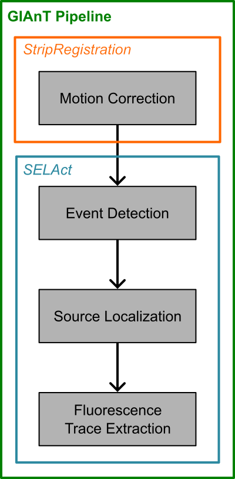

# GIAnT-MATLAB
Glutamate Imaging Analysis Toolbox, MATLAB implementation




## Epoch and Analysis Trial
For each experiment we run through the pipeline, we break down the data into epochs and analysis trials.

Epochs are full experimental sessions that can be aligned with each other (i.e. the same field of view and regions of interest are being imaged). Analysis trials are generally contiguous subsets (in time) of an epoch. These analysis trials may not align exactly with experimental trials.

For SLAP2, analysis trials are the experimental trials if the data was collected using the multi-trial functions of the SLAP2 and each trial is saved off the microscope in a different file. If data was continuously collected on SLAP2, the experiment will be split up into analysis trials of length 200000 lines (~20 sec) to help parallelize processing.

For data not collected on SLAP2, the current GIAnT pipeline sets Epochs to be 1 and each file that is selected to be processed is an analysis trial. These analysis trials must be able to be aligned to one another.

## Trial Table
Each experiment processed with GIAnT first gets a trial_table.h5 file that summarizes relevant file locations and analysis trial structures. The `slap2` group is only populated for SLAP2 experiments. The `motion_correction` and `source_extraction` groups are populated by downstream pipeline stages and will only be present once those stages have run. The structure of the trial_table is as below

```
📦 trial_table.h5
 ├ 📄 datadr
 ├ 📄 savedr
 ├ 📄 filename
 ├ 📄 true_trial_ix
 ├ 📄 epoch
 ├ 📂 slap2
 |  ├ 📂 ref_stack
 |  |  └ 📂 DMD{1,2}
 |  |     ├ 📄 IM
 |  |     ├ 📄 channels
 |  |     ├ 📄 Zs
 |  |     └ 📄 dmdPixel2SampleTransform
 |  ├ 📄 first_line
 |  ├ 📄 last_line
 |  ├ 📄 trial_start_time_inferred
 |  └ 📄 trial_end_time_from_pc
 ├ 📂 motion_correction
 |  ├ 📄 fn_reg_ds
 |  ├ 📄 fn_adata
 |  ├ 📄 fn_raw
 |  ├ 📄 registration_failed
 |  ├ 📄 first_line_original
 |  └ 📄 align_params
 └ 📂 source_extraction
    ├ 📄 analysis_params
    └ 📄 fn_raw
```

## Alignment Data
The motion correction scripts save out a H5 file ending in `_ALIGNMENTDATA.h5` that contains the alignment data for each trial. The structure of the alignment data is as below

```
📦 <trial_stem>_ALIGNMENTDATA.h5
 ├ 📄 numChannels
 ├ 📄 meanIM
 ├ 📄 frametime
 ├ 📄 alignHz
 ├ 📄 motionDSc
 ├ 📄 motionDSr
 ├ 📄 recNegErr
 ├ 📄 motionC
 ├ 📄 motionR
 ├ 📄 DSframes
 ├ 📄 registrationFailed
 └ 📂 slap2
    ├ 📄 varFacDS
    ├ 📄 aError
    ├ 📄 Z
    ├ 📄 cropRow
    ├ 📄 cropCol
    ├ 📄 viewC
    ├ 📄 viewR
    ├ 📄 trimRows
    ├ 📄 trimCols
    ├ 📄 onlineMotionXshift
    ├ 📄 onlineMotionYshift
    └ 📄 onlineMotionZshift
```

## Manual Annotations

In our pipeline, users can manually annotate pixels to exclude from analysis or pixels that correspond to soma, whose signals should be extracted (the pipeline has typically been used for single-neuron simultaneous glutamate + calcium imaging experiments on the SLAP2). When ROIs are annotated (either in `annotateROIs.m` or `SILo.m`), information about the ROIs are saved in the `annotations.h5` file. The structure of that file is as below

```
📦 annotations.h5
 └ 📂 DMD{1,2}
    ├ 📄 dr
    ├ 📄 fn
    ├ 📄 n_rois
    └ 📂 roi_###
       ├ 📄 type
       ├ 📄 label
       ├ 📄 mask
       ├ 📄 position (polygon only)
       ├ 📄 center (circle/ellipse)
       ├ 📄 semi_axes (ellipse)
       ├ 📄 rotation_angle (ellipse)
       └ 📄 radius (circle)
```

## Experiment Summary

The final step of the pipeline, source extraction (Source Identification by Activity Localization; SILo), outputs an `experiment_summary.h5` file which contains the extracted sources as well as other useful data about the experiment. The structure of that file is as follows

```
📦 experiment_summary.h5
 ├ 📄 params
 └ 📂 DMD{1,2}
    ├ 📄 Z_depths (fastz x 1)
    ├ 📂 frame_info
    |  ├ 📄 offlineXshifts (total frames x 1)
    |  ├ 📄 offlineYshifts (total frames x 1)
    |  ├ 📄 offlineZshifts (total frames x 1)
    |  ├ 📄 onlineXshifts (total frames x 1)
    |  ├ 📄 onlineYshifts (total frames x 1)
    |  ├ 📄 onlineZshifts (total frames x 1)
    |  ├ 📄 trial_num_frames (trials x 1)
    |  ├ 📄 frame_line_idxs (total frames x 1)
    |  └ 📄 discard_frames (total frames x 1)
    ├ 📂 visualizations
    |  ├ 📄 mean_im (channels x fastz x rows x cols)
    |  ├ 📄 ref_stack (ref_stack_channels x depths x rows x cols)
    |  |  └ 📄 channels (ref_stack_channels x 1)
    |  └ 📄 act_im (fastz x rows x cols)
    ├ 📂 global
    |  └ 📄 F (channels x total frames)
    ├ 📂 user_rois
    |  ├ 📄 names (rois x 1 string)
    |  ├ 📄 mask (rois x fastz x rows x cols)
    |  ├ 📄 Fsvd (rois x channels x total frames)
    |  └ 📄 F (rois x channels x total frames)
    └ 📂 sources
       ├ 📂 spatial
       |  ├ 📄 profiles (sources x fastz x rows x cols)
       |  └ 📄 coords (sources x 3 [z_loc, x_loc, y_loc])
       └ 📂 temporal
          ├ 📄 dF_ls (sources x channels x total frames)
          ├ 📄 dF_denoised (sources x channels x total frames)
          ├ 📄 events (sources x channels x total frames)
          ├ 📄 F0 (sources x channels x total frames)
          └ 📄 SNR (sources x 1)
```


## File Field Descriptions

### `trial_table.h5`

| Field | Size | Data type | Description |
| --- | --- | --- | --- |
| `datadr` | 1 x 1 | string | Data directory location |
| `savedr` | 1 x 1 | string | Results directory location |
| `filename` | nDMDs x total trials | string (ragged) | Relative file name from `datadr` |
| `true_trial_ix` | nDMDs x total trials | integer | Trial indices unraveled by epochs |
| `epoch` | nDMDs x total trials | integer | Epoch numbers |
| `slap2_info` | — | group | Only saved for SLAP2 experiments |
| `slap2_info/ref_stack/DMD{1,2}/IM` | image dims | numeric | Reference stack image |
| `slap2_info/ref_stack/DMD{1,2}/channels` | 1 x nChannels | numeric | Color channels |
| `slap2_info/ref_stack/DMD{1,2}/Zs` | 1 x nZ | numeric | Z positions |
| `slap2_info/ref_stack/DMD{1,2}/dmdPixel2SampleTransform` | 3 x 3 | numeric | Transformation matrix |
| `slap2_info/first_line` | nDMDs x total trials | integer | First line of each trial |
| `slap2_info/last_line` | nDMDs x total trials | integer | Last line of each trial |
| `slap2_info/trial_start_time_inferred` | 1 x total trials | integer | Inferred trial start times |
| `slap2_info/trial_end_time_from_pc` | 1 x total trials | integer | Trial end times from PC |
| `motion_correction` | — | group | Written by motion correction stage |
| `motion_correction/fn_reg_ds` | nDMDs x total trials | string | Registered + downsampled tif filename |
| `motion_correction/fn_adata` | nDMDs x total trials | string | Alignment metadata `_ALIGNMENTDATA.h5` filename |
| `motion_correction/fn_raw` | nDMDs x total trials | string | Registered raw-resolution file (Bergamo only) |
| `motion_correction/registration_failed` | nDMDs x total trials | bool | Whether registration failed |
| `motion_correction/first_line_original` | nDMDs x total trials | integer | Original `slap2_info/first_line` before reVolt adjustment |
| `motion_correction/align_params` | — | struct | Alignment parameters used |
| `source_extraction` | — | group | Written by source extraction stage |
| `source_extraction/analysis_params` | — | struct | Analysis parameters used |
| `source_extraction/fn_raw` | nDMDs x total trials | string | Raw file source extraction reads from per trial |

### `<trial_stem>_ALIGNMENTDATA.h5`

Top-level fields are shared across microscopes; `motionC`/`motionR` by `StripRegistration.m` (Bergamo); `DSframes`/`registrationFailed` by `MultiRoiRegistration.m` (SLAP2). The `slap2` group is only populated for SLAP2 experiments.

| Field | Size | Data type | Description |
| --- | --- | --- | --- |
| `numChannels` | 1 x 1 | integer | Number of channels in the recording |
| `meanIM` | channels x rows x cols | single | Per-channel mean of motion-corrected frames |
| `frametime` | 1 x 1 | numeric | Seconds per downsampled frame |
| `alignHz` | 1 x 1 | numeric | Frame rate (Hz) at which alignment was performed |
| `motionDSc` | 1 x nDSframes | numeric | Inferred column shift per downsampled frame |
| `motionDSr` | 1 x nDSframes | numeric | Inferred row shift per downsampled frame |
| `recNegErr` | 1 x nDSframes | numeric | Per-frame reconstruction error used for motion censoring |
| `motionC` | 1 x nFrames | numeric | Column shift upsampled to raw frame rate (Bergamo only) |
| `motionR` | 1 x nFrames | numeric | Row shift upsampled to raw frame rate (Bergamo only) |
| `DSframes` | 1 x nDSframes | integer | Line indices of each downsampled frame (SLAP2 only) |
| `registrationFailed` | 1 x 1 | bool | Whether registration failed for this trial (SLAP2 only) |
| `slap2` | — | group | Only saved for SLAP2 experiments |
| `slap2/varFacDS` | rows x cols x nDSframes | numeric | Variance factor; multiply pixel intensity to get a value proportional to its variance |
| `slap2/aError` | 1 x nDSframes | numeric | Alignment error (1 − corrCoeff²) per downsampled frame |
| `slap2/Z` | 1 x 1 | numeric | Imaged Z position from microscope metadata |
| `slap2/cropRow` | 1 x 1 | integer | Row offset to add to ROIs to index into original recording |
| `slap2/cropCol` | 1 x 1 | integer | Column offset to add to ROIs to index into original recording |
| `slap2/viewC` | (rows+2·maxshift) x (cols+2·maxshift) | numeric | Column interpolation grid for remapping into saved tiff space |
| `slap2/viewR` | (rows+2·maxshift) x (cols+2·maxshift) | numeric | Row interpolation grid for remapping into saved tiff space |
| `slap2/trimRows` | 1 x nTrimRows | integer | Row indices used to remap images from the datafile into saved tiff space |
| `slap2/trimCols` | 1 x nTrimCols | integer | Column indices used to remap images from the datafile into saved tiff space |
| `slap2/onlineMotionXshift` | 1 x nDSframes | numeric | Online motion-correction X shift from the microscope |
| `slap2/onlineMotionYshift` | 1 x nDSframes | numeric | Online motion-correction Y shift from the microscope |
| `slap2/onlineMotionZshift` | 1 x nDSframes | numeric | Online motion-correction Z shift from the microscope |

### `annotations.h5`

`annotations.h5` is written by `annotateROIs.m` and by `SILo.m` (when `drawUserRois=true`).  
String fields are stored as UTF-16 code units (`uint16`) for robust MATLAB/Python compatibility.

| Field | Size | Data type | Description |
| --- | --- | --- | --- |
| `DMD{n}` | — | group | One group per DMD in trial-table order |
| `DMD{n}/dr` | 1 x nChars | uint16 | Motion-correction directory used while drawing these ROIs |
| `DMD{n}/fn` | 1 x nChars | uint16 | Trial stem used when displaying ROI GUI |
| `DMD{n}/n_rois` | 1 x 1 | uint32 | Number of saved ROI entries for this DMD |
| `DMD{n}/roi_###/type` | 1 x nChars | uint16 | ROI geometry type: `polygon`, `circle`, or `ellipse` |
| `DMD{n}/roi_###/label` | 1 x nChars | uint16 | User label (e.g., `SOMA`) |
| `DMD{n}/roi_###/mask` | rows x cols | uint8 | Binary ROI mask in image coordinates (1 = included pixel) |
| `DMD{n}/roi_###/position` | nVertices x 2 | double | Polygon vertices `[x y]` (polygon only) |
| `DMD{n}/roi_###/center` | 1 x 2 | double | Center `[x y]` (circle/ellipse) |
| `DMD{n}/roi_###/semi_axes` | 1 x 2 | double | Ellipse semi-axes lengths (ellipse only) |
| `DMD{n}/roi_###/rotation_angle` | 1 x 1 | double | Ellipse rotation angle in degrees (ellipse only) |
| `DMD{n}/roi_###/radius` | 1 x 1 | double | Circle radius (circle only) |

### `experiment_summary.h5`

Field reference for the layout in the schematic tree above (per-DMD HDF5 groups). `SILo.m` currently writes `ExperimentSummary-*.mat` in `source_extraction/`; an HDF5 export is expected to mirror these paths. Dimensions use one `total frames` axis for all trials from that DMD stitched in time.

| Field | Size | Data type | Description |
| --- | --- | --- | --- |
| `params` | — | struct | Analysis parameters (`SILo` `params` struct) |
| `DMD{n}` | — | group | One group per DMD |
| `DMD{n}/Z_depths` | fastz x 1 | numeric | Z depths per imaging plane |
| `DMD{n}/frame_info` | — | group | Trial and frame bookkeeping for stitched time series |
| `DMD{n}/frame_info/offlineXshifts` | total frames x 1 | numeric | Offline registration X shift per frame |
| `DMD{n}/frame_info/offlineYshifts` | total frames x 1 | numeric | Offline registration Y shift per frame |
| `DMD{n}/frame_info/offlineZshifts` | total frames x 1 | numeric | Offline registration Z shift per frame |
| `DMD{n}/frame_info/onlineXshifts` | total frames x 1 | numeric | (SLAP2 only) online X shift per frame |
| `DMD{n}/frame_info/onlineYshifts` | total frames x 1 | numeric | (SLAP2 only) online Y shift per frame |
| `DMD{n}/frame_info/onlineZshifts` | total frames x 1 | numeric | (SLAP2 only) online Z shift per frame |
| `DMD{n}/frame_info/trial_num_frames` | trials x 1 | integer | Number of frames contributed by each analysis trial |
| `DMD{n}/frame_info/frame_line_idxs` | total frames x 1 | integer | Raw line (SLAP2) or frame (other microscopes) index for each frame in the stitched series |
| `DMD{n}/frame_info/discard_frames` | total frames x 1 | bool or uint8 | Frame excluded from analysis (e.g., motion censoring) |
| `DMD{n}/visualizations` | — | group | Static images for QC and publication |
| `DMD{n}/visualizations/mean_im` | channels x fastz x rows x cols | numeric | Mean registered image per channel / Z slice |
| `DMD{n}/visualizations/ref_stack` | ref_stack_channels x depths x rows x cols | numeric | (SLAP2 only) Reference stack used for alignment / display |
| `DMD{n}/visualizations/ref_stack/channels` | ref_stack_channels x 1 | numeric | (SLAP2 only) Channel index or ID for each plane in `ref_stack` |
| `DMD{n}/visualizations/act_im` | fastz x rows x cols | numeric | Activity / localization summary image (single contrast) |
| `DMD{n}/global` | — | group | Whole-field signals |
| `DMD{n}/global/F` | channels x total frames | numeric | Fluorescence traces over the field (one column per channel) |
| `DMD{n}/user_rois` | — | group | Traces from manually drawn ROIs (when present) |
| `DMD{n}/user_rois/names` | rois x 1 | string | User-defined ROI names |
| `DMD{n}/user_rois/mask` | rois x fastz x rows x cols | uint8 or bool | Stacked binary masks for each user ROI |
| `DMD{n}/user_rois/Fsvd` | rois x channels x total frames | numeric | ROI signals after SVD / projection step (if used) |
| `DMD{n}/user_rois/F` | rois x channels x total frames | numeric | Raw or baseline-corrected ROI fluorescence |
| `DMD{n}/sources` | — | group | SILo-detected sources |
| `DMD{n}/sources/spatial` | — | group | Spatial fingerprints and locations |
| `DMD{n}/sources/spatial/profiles` | sources x fastz x rows x cols | numeric | Spatial component / pixel weights per source |
| `DMD{n}/sources/spatial/coords` | sources x 3 | numeric | Source centers per row: `[z_loc, x_loc, y_loc]` |
| `DMD{n}/sources/temporal` | — | group | Frame-by-frame source activity |
| `DMD{n}/sources/temporal/dF_ls` | sources x channels x total frames | numeric | Least-squares ΔF (absolute or scaled) |
| `DMD{n}/sources/temporal/dF_denoised` | sources x channels x total frames | numeric | Denoised ΔF |
| `DMD{n}/sources/temporal/events` | sources x channels x total frames | numeric | Deconvolved source events |
| `DMD{n}/sources/temporal/F0` | sources x channels x total frames | numeric | Baseline estimate used for normalization |
| `DMD{n}/sources/temporal/SNR` | sources x 1 | numeric | Signal-to-noise ratio metric |
