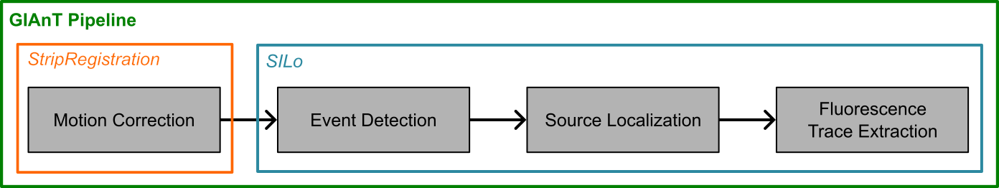

# GIAnT-MATLAB

**GIAnT** (Glutamate Imaging Analysis Toolbox) is a MATLAB pipeline for processing glutamate imaging data.



## Install

### MATLAB

Tested from **MATLAB R2023b** onward.

**Required toolboxes**
* Parallel Computing Toolbox
* Image Processing Toolbox
* Optimization Toolbox
* Signal Processing Toolbox
* Statistics and Machine Learning Toolbox

Clone this repository and add it (and its subfolders) to the MATLAB path:

```matlab
addpath(genpath('/path/to/GIAnT-MATLAB'));
```

Also add any external packages below to the path (e.g. `addpath(genpath(...))`).

### External packages

* **[Fast_Tiff_Write](https://github.com/rharkes/Fast_Tiff_Write)** — required for motion-correction TIFF writing (`Fast_BigTiff_Write`). Use commit [`ddd50c3286ff5b013d1f0478e8a5bd0d60978a75`](https://github.com/rharkes/Fast_Tiff_Write/commit/ddd50c3286ff5b013d1f0478e8a5bd0d60978a75). Do **not** use a later revision without checking TIFF orientation compatibility (upstream changed orientation after this commit).

  ```bash
  git clone https://github.com/rharkes/Fast_Tiff_Write.git
  cd Fast_Tiff_Write
  git checkout ddd50c3286ff5b013d1f0478e8a5bd0d60978a75
  ```

* **[NoRMCorre](https://github.com/flatironinstitute/NoRMCorre)** — required for the default (`StripRegistration`) motion-correction path.

* **SLAP2 data reader (only needed for SLAP2 data)** — add one of:
  - **[Slap2DataReader](https://github.com/m-xie/Slap2DataReader)**
  - **`slap2` from MBF Bioscience**

## How to run (default / non-SLAP2)

Typical flow for standard multi-TIFF / ScanImage-style recordings:

1. **`buildTrialTable`** — choose a data folder (and optional save folder). Writes `trial_table.h5` under the save directory.
2. **`StripRegistration`** — select that `trial_table.h5` (or pass its path). Writes registered TIFFs and `*_ALIGNMENTDATA.h5` under `motion_correction/`. Requires NoRMCorre and Fast_Tiff_Write on the path.
3. **Optional: `annotateROIs`** — draw exclude / soma ROIs; writes `annotations.h5`.
4. **`SILo`** — select the same `trial_table.h5` (or its folder). In the parameter GUI, leave **`isSLAP2`** as `false` (default). Writes `experiment_summary.h5` and `per_trial_summary.h5` under `source_extraction/`.

Example (interactive prompts omitted when paths are passed):

```matlab
buildTrialTable;                          % or buildTrialTable(datadr, savedr)
StripRegistration;                        % or StripRegistration(pathToTrialTable)
% annotateROIs;                           % optional
SILo;                                     % or SILo(pathToTrialTable)  % isSLAP2 = false
```

## How to run (SLAP2)

1. **`buildTrialTableSLAP2`** — builds `trial_table.h5` (including `slap2_info`) for SLAP2 `.dat` / metadata layouts.
2. **Motion correction** — choose one:
   - **`MultiRoiRegistration`** — multi-ROI raster SLAP2
   - **`BandRegistration`** — band-scan SLAP2  
   Requires a SLAP2 reader and Fast_Tiff_Write on the path (NoRMCorre is not used on these paths).
3. **Optional: `annotateROIs`**
4. **`SILo`** — in the parameter GUI, set **`isSLAP2`** to `true`.

```matlab
buildTrialTableSLAP2;
MultiRoiRegistration;   % or BandRegistration
% annotateROIs;
SILo;                   % isSLAP2 = true
```

### Runtime and resource optimizations

The SLAP2 processing path includes several optimizations for large multi-ROI recordings:

* **`MultiRoiRegistration`** streams the large `/slap2/varFacDS` variance-factor movie directly to H5 in small batches instead of holding the full 3-D array in each parallel worker. Registration also searches only within `clipShift` of the previous motion estimate, preventing correlation cost from growing with accumulated XY drift.
* **`SILo`** reads alignment metadata without loading `/slap2/varFacDS` into memory and performs activity localization in bounded spatial tiles. Variance data are read lazily from H5; when needed, they are temporarily rechunked for efficient spatial access.
* **Parallel worker counts are RAM-aware.** SILo estimates a safe worker count from available memory and registered-movie size rather than assuming that every requested worker can run concurrently.
* `localizationTileSize` (default `96` pixels) controls the SILo localization RAM/speed tradeoff. `localizationTempDir` controls where temporary rechunked H5 data are stored; a fast local SSD is recommended for best performance.

These changes substantially reduce peak RAM use, especially when processing several trials in parallel, while retaining the existing output-file schema. The main tradeoff is increased temporary disk I/O during SILo localization. For motion-heavy recordings, choose `clipShift` large enough to accommodate true frame-to-frame motion and QC the resulting motion traces.

## Epoch and analysis trial

For each experiment we break the data into **epochs** and **analysis trials**.

Epochs are full experimental sessions that can be aligned with each other (same field of view / ROIs). Analysis trials are contiguous subsets (in time) of an epoch; they may not match experimental trial boundaries exactly.

**SLAP2:** analysis trials are the experimental trials when multi-trial acquisition wrote one file per trial. For continuous SLAP2 acquisition, the experiment is split into analysis trials of length 200000 lines (~20 s) to help parallelize processing.

**Non-SLAP2:** the pipeline sets epoch = 1 and treats each selected file as an analysis trial. Those trials must be alignable to one another.

## Pipeline outputs

### Reading H5 outside MATLAB

GIAnT writes H5 from MATLAB. **Dimension tuples in this README match MATLAB `size()`** for each dataset (column-major in memory).

`h5py` and other non-MATLAB readers may assume a row-major order for the data. When reading data using Python or other languages, data axes may need to be permuted to match the axis orders listed here.

### Trial Table
Each experiment processed with GIAnT first gets a trial_table.h5 file that summarizes relevant file locations and analysis trial structures. The `slap2_info` group is only populated for SLAP2 experiments. The `motion_correction` and `source_extraction` groups are populated by downstream pipeline stages and will only be present once those stages have run. The structure of the trial_table is as below (🗄️ file · 📁 group · 🔤 string · 🔢 integer · 📈 numeric · 🖼️ image · ☑️ bool):

```
🗄️ trial_table.h5
 ├ 🔤 datadr
 ├ 🔤 savedr
 ├ 🔤 filename
 ├ 🔢 true_trial_ix
 ├ 🔢 epoch
 ├ ☑️ row_major
 ├ 📁 slap2_info
 |  ├ 📁 ref_stack
 |  |  └ 📁 Path{1,2}
 |  |     ├ 🖼️ IM
 |  |     ├ 🔢 channels
 |  |     ├ 📈 Zs
 |  |     └ 📈 dmdPixel2SampleTransform
 |  ├ 🔢 first_line
 |  ├ 🔢 last_line
 |  ├ 🔢 trial_start_time_inferred
 |  └ 🔢 trial_end_time_from_pc
 ├ 📁 motion_correction
 |  ├ 🔤 fn_reg_ds
 |  ├ 🔤 fn_adata
 |  ├ 🔤 fn_raw
 |  ├ ☑️ registration_failed
 |  ├ 🔢 first_line_original
 |  └ 📁 align_params
 └ 📁 source_extraction
    ├ 📁 analysis_params
    └ 🔤 fn_raw
```

### Alignment Data
The motion correction scripts save out a H5 file ending in `_ALIGNMENTDATA.h5` that contains the alignment data for each trial. The structure of the alignment data is as below

```
🗄️ <trial_stem>_ALIGNMENTDATA.h5
 ├ ☑️ row_major
 ├ 📈 numChannels
 ├ 📈 frametime
 ├ 📈 alignHz
 ├ 📈 motionDSc
 ├ 📈 motionDSr
 ├ 📈 motionDSz           (BandRegistration always; MultiRoiRegistration when refStackTemplate is enabled)
 ├ 🖼️ meanIM              (StripRegistration and MultiRoiRegistration only; not written by BandRegistration)
 ├ 📈 recNegErr           (StripRegistration and MultiRoiRegistration only; not written by BandRegistration)
 ├ 📈 motionC             (StripRegistration only)
 ├ 📈 motionR             (StripRegistration only)
 ├ 📈 motionZ             (reserved; not written by any current script)
 ├ 📈 brightnessDS        (BandRegistration only)
 ├ 📈 logLikelihoodDS     (BandRegistration only)
 ├ 🔢 DSframes            (SLAP2 only: MultiRoiRegistration and BandRegistration)
 ├ ☑️ registrationFailed  (SLAP2 only: MultiRoiRegistration and BandRegistration)
 └ 📁 slap2               (SLAP2 only)
    ├ 📈 onlineMotionXshift
    ├ 📈 onlineMotionYshift
    ├ 📈 onlineMotionZshift
    ├ 🖼️ varFacDS          (MultiRoiRegistration only)
    ├ 📈 Z_depths          (MultiRoiRegistration only)
    ├ 🔢 cropRow           (MultiRoiRegistration only)
    ├ 🔢 cropCol           (MultiRoiRegistration only)
    ├ 🖼️ viewC             (MultiRoiRegistration only)
    ├ 🖼️ viewR             (MultiRoiRegistration only)
    ├ 🔢 trimRows          (MultiRoiRegistration only)
    └ 🔢 trimCols          (MultiRoiRegistration only)
```

### Manual Annotations

In our pipeline, users can manually annotate pixels to exclude from analysis or pixels that correspond to soma, whose signals should be extracted (e.g. single-neuron simultaneous glutamate + calcium imaging). When ROIs are annotated (either in `annotateROIs.m` or `SILo.m`), information about the ROIs are saved in the `annotations.h5` file. The structure of that file is as below

```
🗄️ annotations.h5
 ├ ☑️ row_major
 ├ ☑️ coords_zero_indexed
 └ 📁 Path{1,2}
    ├ 🔤 dr
    ├ 🔤 fn
    ├ 🔢 n_rois
    └ 📁 roi_###
       ├ 🔤 type
       ├ 🔤 label
       ├ 🖼️ mask
       ├ 📈 position (polygon only; nVertices x 2 [y_loc, x_loc] when flagged)
       ├ 📈 center (circle/ellipse; 1 x 2 [y_loc, x_loc] when flagged)
       ├ 📈 semi_axes (ellipse)
       ├ 📈 rotation_angle (ellipse)
       └ 📈 radius (circle)
```

### Experiment Summary

The final step of the pipeline, source extraction (Source Identification by Activity Localization; SILo), outputs an `experiment_summary.h5` file which contains the extracted sources as well as other useful data about the experiment. The structure of that file is as follows

```
🗄️ experiment_summary.h5
 ├ ☑️ row_major
 ├ 📁 params
 └ 📁 Path{1,2}
    ├ 📈 Z_depths (fastz x 1)
    ├ 📁 sources
    |  ├ 📁 temporal
    |  |  ├ 📈 dF_ls (sources x channels x total frames)
    |  |  ├ 📈 dF_denoised (sources x channels x total frames)
    |  |  ├ 📈 events (sources x channels x total frames)
    |  |  ├ 📈 F0 (sources x channels x total frames)
    |  |  └ 📈 SNR (sources x 1)
    |  └ 📁 spatial
    |     ├ 🖼️ profiles (sources x fastz x rows x cols)
    |     └ 📈 coords (sources x 3 [z_loc, y_loc, x_loc])
    ├ 📁 user_rois
    |  ├ 🔤 labels (rois x 1)
    |  ├ 🖼️ mask (rois x fastz x rows x cols)
    |  ├ 📈 Fsvd (rois x channels x total frames)
    |  └ 📈 F (rois x channels x total frames)
    ├ 📁 visualizations
    |  ├ 🖼️ mean_im (channels x fastz x rows x cols)
    |  ├ 🖼️ act_im (fastz x rows x cols)
    |  └ 🖼️ act_im_peaks (sources x 3 [z_loc, y_loc, x_loc])
    ├ 📁 global
    |  └ 📈 F (channels x total frames)
    └ 📁 frame_info
       ├ 📈 offlineXshifts (total frames x 1)
       ├ 📈 offlineYshifts (total frames x 1)
       ├ 📈 offlineZshifts (total frames x 1)
       ├ 📈 onlineXshifts (total frames x 1)
       ├ 📈 onlineYshifts (total frames x 1)
       ├ 📈 onlineZshifts (total frames x 1)
       ├ 🔢 trial_num_frames (trials x 1)
       ├ 🔢 frame_line_idxs (total frames x 1)
       └ ☑️ discard_frames (total frames x 1)
```

A summary file of per-trial data is also saved as `per_trial_summary.h5` for any fields that may vary across analysis trials. The structure of that file is as follows

```
🗄️ per_trial_summary.h5
 ├ ☑️ row_major
 └ 📁 Path{1,2}
    ├ 📁 sources
    |  ├ 📁 temporal
    |  |  └ 📈 per_trial_SNR (trials x sources)
    |  └ 📁 spatial
    |     ├ 🖼️ per_trial_profiles (trials x sources x fastz x rows x cols)
    |     └ 📈 per_trial_coords (trials x sources x 3 [z_loc, y_loc, x_loc])
    └ 📁 visualizations
       ├ 🖼️ per_trial_mean_im (trials x channels x fastz x rows x cols)
       ├ 🖼️ per_trial_act_im (trials x fastz x rows x cols)
       ├ 🖼️ per_trial_act_im_peaks (trials x max_peaks x 3 [z_loc, y_loc, x_loc])
       └ 🔢 per_trial_num_peaks (trials x 1)
```


### Band Registration Lookup Table (intermediate file)

`BandRegistration` builds this file once per experiment under `motion_correction/bandRegLookupTable.h5` and reuses it on subsequent runs.

```
🗄️ bandRegLookupTable.h5
 ├ 🔢 xPre
 ├ 🔢 xPost
 ├ 🔢 yPre
 ├ 🔢 yPost
 ├ ☑️ row_major
 └ 📁 Path{1,2}
    ├ 📈 likelihood_means (Y x X x Z x C x nSP)
    ├ 🔢 allSuperPixelIDs (nSP x 1)
    ├ 🔢 sparseMaskInds (N x 2)
    ├ 🔢 zPre
    ├ 🔢 zPost
    └ 📈 fastZ2RefZ
```

## File Field Descriptions

### `trial_table.h5`

| Field | Size | Data type | Description |
| --- | --- | --- | --- |
| `row_major` | 1 x 1 | uint8 | Layout flag: `1` = row-major (README sizes match h5py `shape`); `0` = column-major (MATLAB `size()`). **If absent, assume column-major (`0`).** |
| `datadr` | 1 x 1 | string | Data directory location |
| `savedr` | 1 x 1 | string | Results directory location |
| `filename` | nPaths x total trials | string (ragged) | Relative file name from `datadr` |
| `true_trial_ix` | nPaths x total trials | integer | Trial indices unraveled by epochs |
| `epoch` | nPaths x total trials | integer | Epoch numbers |
| `slap2_info` | — | group | Only saved for SLAP2 experiments |
| `slap2_info/ref_stack/Path{1,2}/IM` | image dims | numeric | Reference stack image |
| `slap2_info/ref_stack/Path{1,2}/channels` | 1 x nChannels | numeric | Color channels |
| `slap2_info/ref_stack/Path{1,2}/Zs` | 1 x nZ | numeric | Z positions |
| `slap2_info/ref_stack/Path{1,2}/dmdPixel2SampleTransform` | 3 x 3 | numeric | Transformation matrix |
| `slap2_info/first_line` | nPaths x total trials | integer | First line of each trial |
| `slap2_info/last_line` | nPaths x total trials | integer | Last line of each trial |
| `slap2_info/trial_start_time_inferred` | 1 x total trials | integer | Inferred trial start times |
| `slap2_info/trial_end_time_from_pc` | 1 x total trials | integer | Trial end times from PC |
| `motion_correction` | — | group | Written by motion correction stage |
| `motion_correction/fn_reg_ds` | nPaths x total trials | string | Registered + downsampled tif filename |
| `motion_correction/fn_adata` | nPaths x total trials | string | Alignment metadata `_ALIGNMENTDATA.h5` filename |
| `motion_correction/fn_raw` | nPaths x total trials | string | Registered raw-resolution file (`StripRegistration` only) |
| `motion_correction/registration_failed` | nPaths x total trials | bool | Whether registration failed |
| `motion_correction/first_line_original` | nPaths x total trials | integer | Original `slap2_info/first_line` before reVolt adjustment |
| `motion_correction/align_params` | — | struct | Alignment parameters used |
| `source_extraction` | — | group | Written by source extraction stage |
| `source_extraction/analysis_params` | — | struct | Analysis parameters used |
| `source_extraction/fn_raw` | nPaths x total trials | string | Raw file source extraction reads from per trial |

### `<trial_stem>_ALIGNMENTDATA.h5`

| Field | Size | Data type | Description |
| --- | --- | --- | --- |
| `row_major` | 1 x 1 | uint8 | Layout flag: `1` = row-major (README sizes match h5py `shape`); `0` = column-major (MATLAB `size()`). **If absent, assume column-major (`0`).** |

Top-level fields written by **all three** motion correction scripts: `numChannels`, `frametime`, `alignHz`, `motionDSc`, `motionDSr`. `meanIM` and `recNegErr` are written by `StripRegistration.m` and `MultiRoiRegistration.m` but **not** by `BandRegistration.m`. `motionC`/`motionR` are written only by `StripRegistration.m`; `DSframes`/`registrationFailed` by both SLAP2 scripts (`MultiRoiRegistration.m` and `BandRegistration.m`); `brightnessDS`/`logLikelihoodDS` by `BandRegistration.m` only. The `slap2` group is only populated for SLAP2 experiments.

| Field | Size | Data type | Description |
| --- | --- | --- | --- |
| `numChannels` | 1 x 1 | integer | Number of channels in the recording |
| `meanIM` | channels x rows x cols | single | Per-channel mean of motion-corrected frames (not written by BandRegistration) |
| `frametime` | 1 x 1 | numeric | Seconds per downsampled frame |
| `alignHz` | 1 x 1 | numeric | Frame rate (Hz) at which alignment was performed |
| `motionDSc` | 1 x nDSframes | numeric | Inferred column shift per downsampled frame |
| `motionDSr` | 1 x nDSframes | numeric | Inferred row shift per downsampled frame |
| `motionDSz` | 1 x nDSframes | numeric | Inferred Z shift per downsampled frame; always written by BandRegistration; written by MultiRoiRegistration only when `refStackTemplate` is enabled; never written by StripRegistration |
| `recNegErr` | 1 x nDSframes | numeric | Per-frame reconstruction error; standard alignment QC metric and used for motion censoring (not written by BandRegistration) |
| `brightnessDS` | nDSframes x channels | numeric | (BandRegistration only) Per-channel brightness/scaling factor at the selected motion shift |
| `logLikelihoodDS` | nDSframes x 1 | numeric | (BandRegistration only) Peak log-likelihood of the motion match per downsampled frame |
| `motionC` | 1 x nFrames | numeric | Column shift upsampled to raw frame rate (`StripRegistration` only) |
| `motionR` | 1 x nFrames | numeric | Row shift upsampled to raw frame rate (`StripRegistration` only) |
| `motionZ` | 1 x nFrames | numeric | (reserved; not written by any current script) Z shift upsampled to raw frame rate |
| `DSframes` | 1 x nDSframes | integer | Line indices of each downsampled frame (SLAP2 only: MultiRoiRegistration and BandRegistration) |
| `registrationFailed` | 1 x 1 | bool | Whether registration failed for this trial (SLAP2 only: MultiRoiRegistration and BandRegistration) |
| `slap2` | — | group | Only saved for SLAP2 experiments |
| `slap2/varFacDS` | rows x cols x nDSframes | numeric | (MultiRoiRegistration only) Variance factor; multiply pixel intensity to get a value proportional to its variance |
| `slap2/Z_depths` | fastz x 1 | numeric | (MultiRoiRegistration only) Imaged Z depths from microscope metadata |
| `slap2/cropRow` | 1 x 1 | integer | (MultiRoiRegistration only) Row offset to add to ROIs to index into original recording |
| `slap2/cropCol` | 1 x 1 | integer | (MultiRoiRegistration only) Column offset to add to ROIs to index into original recording |
| `slap2/viewC` | (rows+2·maxshift) x (cols+2·maxshift) | numeric | (MultiRoiRegistration only) Column interpolation grid for remapping into saved tiff space |
| `slap2/viewR` | (rows+2·maxshift) x (cols+2·maxshift) | numeric | (MultiRoiRegistration only) Row interpolation grid for remapping into saved tiff space |
| `slap2/trimRows` | 1 x nTrimRows | integer | (MultiRoiRegistration only) Row indices used to remap images from the datafile into saved tiff space |
| `slap2/trimCols` | 1 x nTrimCols | integer | (MultiRoiRegistration only) Column indices used to remap images from the datafile into saved tiff space |
| `slap2/onlineMotionXshift` | 1 x nDSframes | numeric | Online motion-correction X shift from the microscope |
| `slap2/onlineMotionYshift` | 1 x nDSframes | numeric | Online motion-correction Y shift from the microscope |
| `slap2/onlineMotionZshift` | 1 x nDSframes | numeric | Online motion-correction Z shift from the microscope |

### `bandRegLookupTable.h5`

`BandRegistration` writes this cached lookup table to `motion_correction/` on the first run and loads it on later runs. XY search limits (`xPre`, `yPre`, etc.) are shared across paths; per-path superpixel and reference-stack data live under `Path{n}` (one group per DMD, in trial-table path order). `Y`, `X`, and `Z` are the row, column, and reference-stack Z dimensions of the motion search cube (`yPre + yPost + 1`, etc.).

| Field | Size | Data type | Description |
| --- | --- | --- | --- |
| `row_major` | 1 x 1 | uint8 | Layout flag: `1` = row-major (README sizes match h5py `shape`); `0` = column-major (MATLAB `size()`). **If absent, assume column-major (`0`).** |
| `xPre` | 1 x 1 | numeric | Maximum column shift searched **before** the reference position (pixels); equals `align_params.maxshiftXY` |
| `xPost` | 1 x 1 | numeric | Maximum column shift searched **after** the reference position (pixels); equals `align_params.maxshiftXY` |
| `yPre` | 1 x 1 | numeric | Maximum row shift searched **before** the reference position (pixels); equals `align_params.maxshiftXY` |
| `yPost` | 1 x 1 | numeric | Maximum row shift searched **after** the reference position (pixels); equals `align_params.maxshiftXY` |
| `Path{n}` | — | group | One group per imaging path (DMD) |
| `Path{n}/likelihood_means` | Y x X x Z x C x nSP | single | Precomputed expected superpixel mean intensity in the padded reference stack at each displacement in the search cube, per channel and superpixel; used as the template for Poisson or correlation motion inference |
| `Path{n}/allSuperPixelIDs` | nSP x 1 | numeric | Unique superpixel keys for this path: `superPixIdx * 100 + zIdx` (integration-mode pixels only when `integrationOnly` is true) |
| `Path{n}/sparseMaskInds` | N x 2 | numeric | Sparse ROI definition: column 1 = linear DMD pixel index (`rows x cols x numFastZs` layout); column 2 = superpixel index (1 … nSP) |
| `Path{n}/zPre` | 1 x 1 | numeric | Maximum reference-stack Z shift searched **before** the matched plane (planes); capped by `align_params.maxshiftZ` and available reference Z planes |
| `Path{n}/zPost` | 1 x 1 | numeric | Maximum reference-stack Z shift searched **after** the matched plane (planes); capped similarly to `zPre` |
| `Path{n}/fastZ2RefZ` | numFastZs x 1 | numeric | Maps each imaged fast-Z index to the nearest reference-stack Z plane index (used when sampling `likelihood_means`) |

### `annotations.h5`

`annotations.h5` is written by `annotateROIs.m` and by `SILo.m` (when `drawUserRois=true`).  
String fields are stored as UTF-16 code units (`uint16`) for robust MATLAB/Python compatibility.

**Indexing conventions.** New files set `/coords_zero_indexed` to `1` and store `position`/`center` as **0-indexed `[y_loc, x_loc]`** (row, column), matching image axis order. Legacy files without this flag use MATLAB `images.roi` convention: **1-indexed `[x, y]`** (column, row).

| Field | Size | Data type | Description |
| --- | --- | --- | --- |
| `row_major` | 1 x 1 | uint8 | Layout flag: `1` = row-major (README sizes match h5py `shape`); `0` = column-major (MATLAB `size()`). **If absent, assume column-major (`0`).** |
| `coords_zero_indexed` | 1 x 1 | uint8 | When `1`, `position`/`center` are 0-indexed `[y_loc, x_loc]`; when absent or `0`, legacy 1-indexed `[x, y]` |
| `Path{n}` | — | group | One group per imaging path in trial-table order |
| `Path{n}/dr` | 1 x nChars | uint16 | Motion-correction directory used while drawing these ROIs |
| `Path{n}/fn` | 1 x nChars | uint16 | Trial stem used when displaying ROI GUI |
| `Path{n}/n_rois` | 1 x 1 | uint32 | Number of saved ROI entries for this path |
| `Path{n}/roi_###/type` | 1 x nChars | uint16 | ROI geometry type: `polygon`, `circle`, or `ellipse` |
| `Path{n}/roi_###/label` | 1 x nChars | uint16 | User label (e.g., `SOMA`) |
| `Path{n}/roi_###/mask` | rows x cols | uint8 | Binary ROI mask in image coordinates (1 = included pixel) |
| `Path{n}/roi_###/position` | nVertices x 2 | double | Polygon vertices `[y_loc, x_loc]` when `coords_zero_indexed=1`, else legacy `[x, y]` |
| `Path{n}/roi_###/center` | 1 x 2 | double | Circle/ellipse center `[y_loc, x_loc]` when `coords_zero_indexed=1`, else legacy `[x, y]` |
| `Path{n}/roi_###/semi_axes` | 1 x 2 | double | Ellipse semi-axes lengths (ellipse only) |
| `Path{n}/roi_###/rotation_angle` | 1 x 1 | double | Ellipse rotation angle in degrees (ellipse only) |
| `Path{n}/roi_###/radius` | 1 x 1 | double | Circle radius (circle only) |

### `experiment_summary.h5`

`SILo.m` writes `experiment_summary.h5` in `source_extraction/`. Dimensions use one `total frames` axis for all trials from that path stitched in time.

**Indexing conventions.** Pixel/plane coordinates in `sources/spatial/coords` and related peak/coordinate fields are written in **0-indexed (HDF5/Python)** convention as `[z_loc, y_loc, x_loc]`, matching image axis order (`fastz`, rows, cols). `z_loc` is the 0-based index into the `fastz` axis of `profiles`; `y_loc`/`x_loc` are row/column centroids in `[0, dim-1]`. A few fields are kept **1-indexed** to retain SLAP2 data conventions.

| Field | Size | Data type | Description |
| --- | --- | --- | --- |
| `row_major` | 1 x 1 | uint8 | Layout flag: `1` = row-major (README sizes match h5py `shape`); `0` = column-major (MATLAB `size()`). **If absent, assume column-major (`0`).** |
| `params` | — | struct | Analysis parameters (`SILo` `params` struct). `params/activityChannel` is **1-indexed** into the recording's `numChannels` channels — use it to pick the glutamate channel from any `channels x …` dataset in this file (e.g., `global/F`, `sources/temporal/dF_ls`) |
| `Path{n}` | — | group | One group per imaging path |
| `Path{n}/Z_depths` | fastz x 1 | numeric | Z depths per imaging plane (SLAP2 only) |
| `Path{n}/frame_info` | — | group | Trial and frame bookkeeping for stitched time series |
| `Path{n}/frame_info/offlineXshifts` | total frames x 1 | numeric | Offline registration X shift per frame |
| `Path{n}/frame_info/offlineYshifts` | total frames x 1 | numeric | Offline registration Y shift per frame |
| `Path{n}/frame_info/offlineZshifts` | total frames x 1 | numeric | (optional) Offline registration Z shift per frame; written only when 3D alignment was performed |
| `Path{n}/frame_info/onlineXshifts` | total frames x 1 | numeric | (SLAP2 only) online X shift per frame |
| `Path{n}/frame_info/onlineYshifts` | total frames x 1 | numeric | (SLAP2 only) online Y shift per frame |
| `Path{n}/frame_info/onlineZshifts` | total frames x 1 | numeric | (SLAP2 only) online Z shift per frame |
| `Path{n}/frame_info/trial_num_frames` | trials x 1 | integer | Number of frames contributed by each analysis trial |
| `Path{n}/frame_info/frame_line_idxs` | total frames x 1 | integer | Raw line (SLAP2) or frame (other microscopes) index for each frame in the stitched series. **1-indexed** to keep SLAP2 line indexing convention |
| `Path{n}/frame_info/discard_frames` | total frames x 1 | bool or uint8 | Frame excluded from analysis (e.g., motion censoring) |
| `Path{n}/visualizations` | — | group | Static images for QC and publication |
| `Path{n}/visualizations/mean_im` | channels x fastz x rows x cols | numeric | Mean registered image per channel / Z slice |
| `Path{n}/visualizations/act_im` | fastz x rows x cols | numeric | Activity / localization summary image (single contrast) |
| `Path{n}/visualizations/act_im_peaks` | sources x 3 | numeric | Activity image peak locations used to seed matrix factorization `[z_loc, y_loc, x_loc]`, **0-indexed**; from `exptSummary.sources` row/column coordinates, `z_loc` fixed at `0` |
| `Path{n}/global` | — | group | Whole-field signals |
| `Path{n}/global/F` | channels x total frames | numeric | Fluorescence traces over the field (one column per channel) |
| `Path{n}/user_rois` | — | group | Traces from manually drawn ROIs (when present) |
| `Path{n}/user_rois/labels` | rois x 1 | string | User-defined ROI labels |
| `Path{n}/user_rois/mask` | rois x fastz x rows x cols | uint8 or bool | Stacked binary masks for each user ROI |
| `Path{n}/user_rois/Fsvd` | rois x channels x total frames | numeric | ROI signals after SVD / projection step (if used) |
| `Path{n}/user_rois/F` | rois x channels x total frames | numeric | Raw or baseline-corrected ROI fluorescence |
| `Path{n}/sources` | — | group | SILo-detected sources |
| `Path{n}/sources/spatial` | — | group | Spatial fingerprints and locations |
| `Path{n}/sources/spatial/profiles` | sources x fastz x rows x cols | numeric | Spatial component / pixel weights per source, averaged across trials with footprints |
| `Path{n}/sources/spatial/coords` | sources x 3 | numeric | Source centers per row: `[z_loc, y_loc, x_loc]`, **0-indexed**, computed as the footprint-weighted centroid of the averaged `profiles` |
| `Path{n}/sources/temporal` | — | group | Frame-by-frame source activity |
| `Path{n}/sources/temporal/dF_ls` | sources x channels x total frames | numeric | Least-squares ΔF (absolute or scaled) |
| `Path{n}/sources/temporal/dF_denoised` | sources x channels x total frames | numeric | Denoised ΔF |
| `Path{n}/sources/temporal/events` | sources x channels x total frames | numeric | Deconvolved source events |
| `Path{n}/sources/temporal/F0` | sources x channels x total frames | numeric | Baseline estimate used for normalization |
| `Path{n}/sources/temporal/SNR` | sources x 1 | numeric | (optional) Signal-to-noise ratio metric; only written when extraction emits per-source SNR |

### `per_trial_summary.h5`

`SILo.m` writes `per_trial_summary.h5` alongside `experiment_summary.h5` in `source_extraction/`. The trial axis matches `trial_table.h5` (all analysis trials); trials without alignment or source-extraction data are left as NaN in the corresponding slices.

**Indexing conventions.** Same as `experiment_summary.h5`: coordinate fields use **0-indexed** `[z_loc, y_loc, x_loc]` (image axis order: `fastz`, rows, cols); `z_loc` is the 0-based `fastz` index, currently always `0`.

| Field | Size | Data type | Description |
| --- | --- | --- | --- |
| `row_major` | 1 x 1 | uint8 | Layout flag: `1` = row-major (README sizes match h5py `shape`); `0` = column-major (MATLAB `size()`). **If absent, assume column-major (`0`).** |
| `Path{n}` | — | group | One group per imaging path |
| `Path{n}/visualizations` | — | group | Per-trial static images for QC |
| `Path{n}/visualizations/per_trial_mean_im` | trials x channels x fastz x rows x cols | numeric | Trial-aligned mean registered image per channel / Z slice |
| `Path{n}/visualizations/per_trial_act_im` | trials x fastz x rows x cols | numeric | Trial-aligned activity / localization summary image |
| `Path{n}/visualizations/per_trial_act_im_peaks` | trials x max_peaks x 3 | numeric | Per-trial detected peak locations `[z_loc, y_loc, x_loc]`, **0-indexed**, NaN-padded when a trial has fewer than `max_peaks`; from `exptSummary.peaks` with trial alignment offsets applied |
| `Path{n}/visualizations/per_trial_num_peaks` | trials x 1 | integer | Number of valid peaks per trial; use to slice `per_trial_act_im_peaks` without scanning for NaNs |
| `Path{n}/sources` | — | group | Per-trial SILo source data (when sources were extracted) |
| `Path{n}/sources/spatial` | — | group | Per-trial spatial fingerprints and locations |
| `Path{n}/sources/spatial/per_trial_profiles` | trials x sources x fastz x rows x cols | numeric | Spatial component / pixel weights per source per trial |
| `Path{n}/sources/spatial/per_trial_coords` | trials x sources x 3 | numeric | Source centers per trial: `[z_loc, y_loc, x_loc]`, **0-indexed** (same convention as `experiment_summary.h5` `coords`) |
| `Path{n}/sources/temporal` | — | group | Per-trial source metrics |
| `Path{n}/sources/temporal/per_trial_SNR` | trials x sources | numeric | Per-source SNR for each analysis trial |

## Citation

If you use GIAnT, please cite:

> Xie, M. E., Friedrich, J., Wirsching, E., Shibu, C. J., Seyedolmohadesin, M., Ouellette, N., Wang, T., Svoboda, K., Charles, A. S., & Podgorski, K. *GIAnT: a Glutamate Imaging Analysis Toolbox*.

Machine-readable citation metadata is in [`CITATION.cff`](CITATION.cff).

